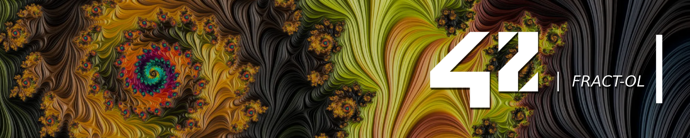

# ❆ 42sp - Fract-ol

<picture>
	
</picture>
<picture >
	
</picture>
<picture >
	
</picture>
<picture >
	
</picture>

##

The `fract-ol` project at 42 school is an exciting exploration into fractal rendering. In this project, students create a graphical application to visualize various types of fractals. The goal is to develop a program that allows users to interactively explore and zoom into intricate fractal patterns, providing both an aesthetic and educational experience.

## Usage

Clone the repository to your local machine:

```bash
$ git clone https://github.com/willtrigo/42_fract-ol.git
```

Navigate to the project directory:

```bash
$ cd 42_fract-ol
```

Build the application:

```bash
$ make
```

Run the `fractol` application:

```bash
$ ./fractol [fractal] [additional_argument]
```

Build the bonus application:

```bash
$ make bonus
```

Run the `fractol_bonus` application:

```bash
$ ./fractol_bonus [fractal] [additional_argument]
```
You can choose one of the three fractals below:

- `mandelbrot`: Visualize the Mandelbrot set. No additional arguments allowed.

- `julia`: Explore the Julia set. You can specify two additional arguments for the real and imaginary complex number between 2.0 and -2.0.

- `tricorn`: Visualize the tricorn set. No additional arguments allowed (only works in the bonus).

## Motion

- **Arrow keys**: Move around the fractal (works only in the bonus).
- **Mouse scroll**: Zoom in or out, (only in the bonus the scroll follow the mouse position).
- `=` **key**: Zoom in (works only in the bonus).
- `-` **key**: Zoom out (works only in the bonus).

## Color schemes (works only in the bonus)

- `1` **key**: Set my default color and reset the position of the fractal.
- `0` **key**: Set color RGB with 0.0 and reset the position of the fractal.
- `r` **key**: Increase color shift R to the fractal.
- `g` **key**: Increase color shift G to the fractal.
- `b` **key**: Increase color shift B to the fractal.
- `c` **key**: Increase all colors shift RGB at once.

##

- `Esc` **key**: Close the window.
